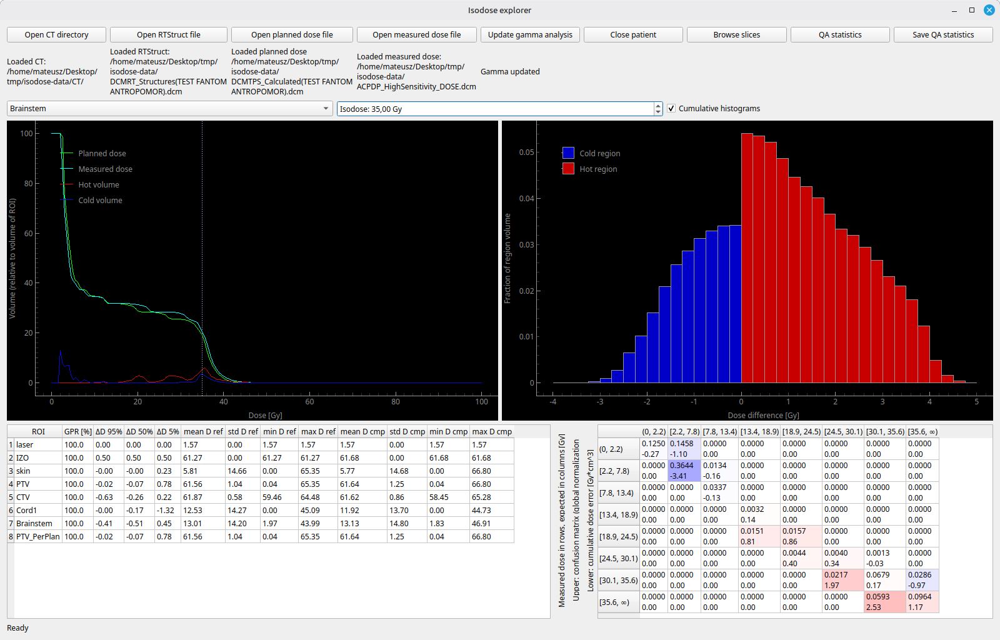
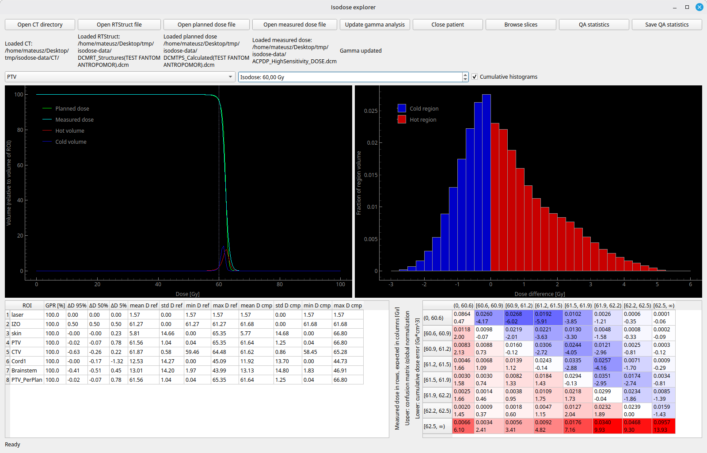
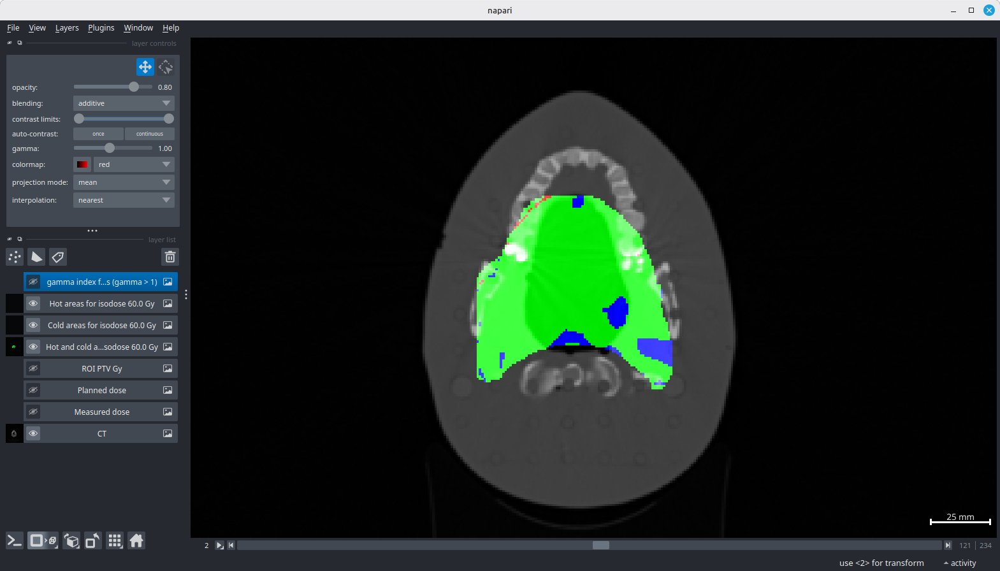
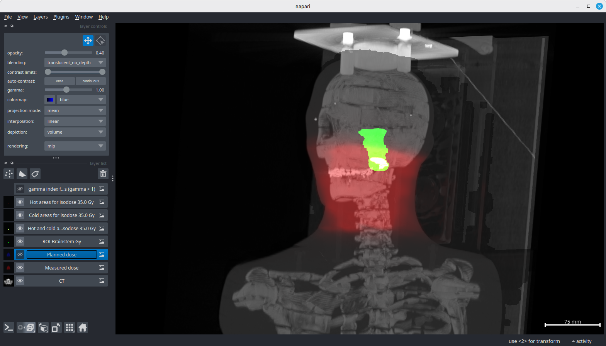
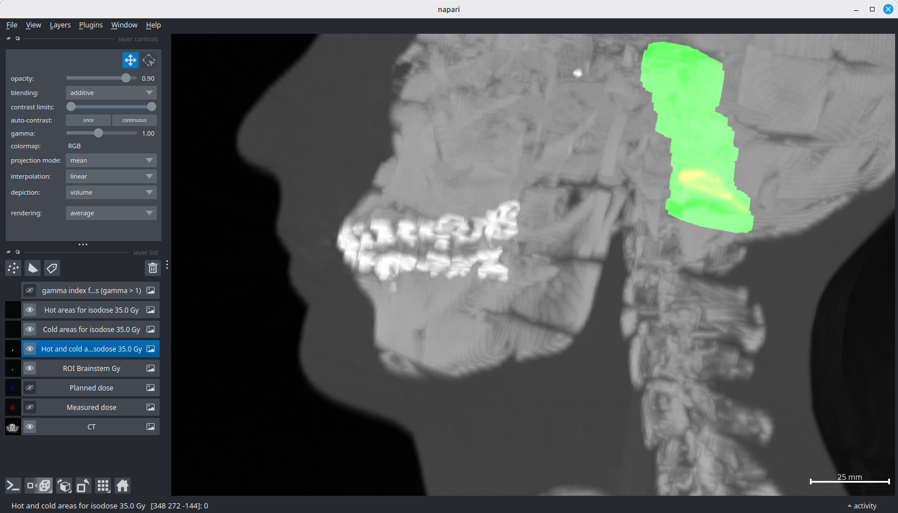
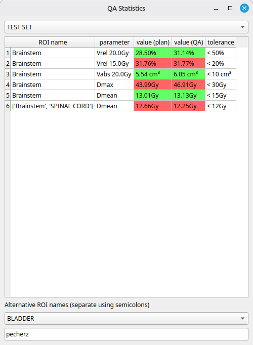

# Isodose viewer

An application for isodose-based patient-specific quality assurance in teleradiotherapy based on the paper:
[Baran M, Tabor Z, Kabat D, et al. Isodoses-a set theory-based patient-specific QA measure to compare planned and delivered isodose distributions in photon radiotherapy. Strahlenther Onkol. 2022;198(9):849-861](http://doi.org/10.1007/s00066-022-01964-9).
To run, initialize a Python 3.12 environment with packages from `requirements.txt` file and run the `main.py` script. 

## User Interface

The following images show the user interface when analyzing a head and neck plan on an anthropomorphic phantom.

Main window, with brainstem and isodose 35 Gy selected.

Main window, with PTV and isodose 60 Gy selected.

Selected slice in a 2D viewer.

3D visualization with planned dose colored red, brainstem colored green.

3D visualization zoomed in. Hot part of the brainstem is colored yellow.

A table with DVH-based statistics and their configurable reference values.

